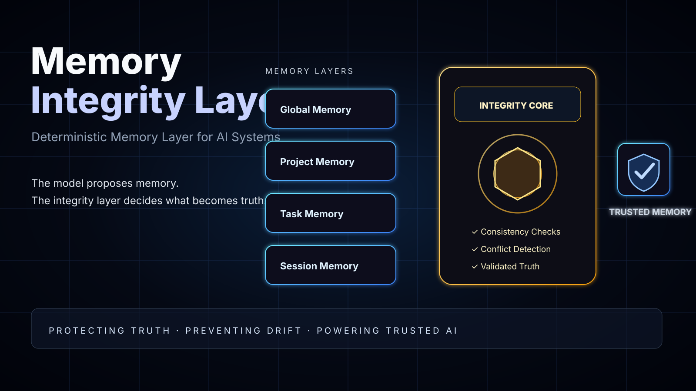

# Hyperlock

**Deterministic governance layer for AI systems.**

> Govern. Validate. Protect.

Hyperlock is an early-stage system for preventing drift, contradiction, and state corruption in AI-assisted workflows.

Modern AI agents and coding assistants are powerful, but they do not reliably preserve project truth over time. They can reintroduce removed components, ignore locked decisions, contradict prior architecture, or silently mutate assumptions across sessions.

Hyperlock introduces a deterministic control layer between human intent and AI output.

The model proposes. Hyperlock validates.

---

## The Problem

AI workflows break when probabilistic generation is treated as project memory.

Common failures:

- previously removed features come back
- locked architecture decisions get ignored
- solved issues get reopened by the model
- agents disagree about current project state
- context drifts across sessions
- teams cannot audit why a decision changed
- humans lose confidence in agentic execution

This is not mainly a model intelligence problem.

It is a **state integrity problem**.

---

## The Core Idea

Hyperlock separates:

- **generation** — what the AI proposes
- **validation** — what the system allows
- **state** — what is accepted as project truth
- **audit** — why the truth changed

Instead of trusting an LLM to remember and enforce every decision, Hyperlock gives AI workflows a deterministic governance layer.

---

## Early Product Direction

Hyperlock is being developed as a governance and validation layer for AI-assisted software teams, agent systems, and complex AI workflows.

Initial focus areas:

- deterministic project state
- architecture decision locking
- conflict detection
- memory update validation
- human override workflows
- audit logs
- agent workflow safety

---

## Current Validation Focus

The current commercial question is not only:

> Is this technically meaningful?

The sharper question is:

> Is this painful enough that teams will budget for it?

We are currently validating:

- who feels this pain first
- where current agent workflows break
- what teams already do manually to prevent drift
- whether Hyperlock should start as a developer tool, agent runtime layer, or AI workflow governance product

See [`docs/VALIDATION_BRIEF.md`](docs/VALIDATION_BRIEF.md).

---

## Repository Status

This repository is in early foundation stage.

Current priority:

1. clarify positioning
2. validate ICP
3. document failure cases
4. define deterministic architecture
5. build the first technical proof

---

## Working Principle

> LLMs generate possibilities.  
> Hyperlock protects truth.
